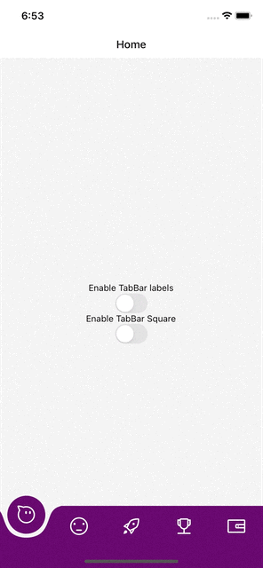

# rn-wave-bottom-bar [](https://github.com/semantic-release/semantic-release) [](https://travis-ci.org/Jm-Zion/rn-wave-bottom-bar) [](https://snyk.io/test/github/Jm-Zion/rn-wave-bottom-bar) [](https://www.codefactor.io/repository/github/jm-zion/rn-wave-bottom-bar)



Custom animated bottom-tab-bar for react-native.

## 💾 Installation

```
yarn add rn-wave-bottom-bar
```

or

```
npm install rn-wave-bottom-bar --save
```

## 📋 Requirements

- React-Navigation v6 installed : https://reactnavigation.org/

## ⚒️ Usage

```jsx
<Tab.Navigator
  screenOptions={{
    tabBarActiveTintColor: '#5F0B65',
    tabBarActiveBackgroundColor: '#5F0B65',
    tabBarInactiveBackgroundColor: 'red',
  }}
  tabBar={(props) => (
    <BottomFabBar
      // Add Shadow for active tab bar button
      focusedButtonStyle={{
        shadowColor: '#000',
        shadowOffset: {
          width: 0,
          height: 7,
        },
        shadowOpacity: 0.41,
        shadowRadius: 9.11,
        elevation: 14,
      }}
      // - You can add the style below to show screen content under the tab-bar
      // - It will makes the "transparent tab bar" effect.
      bottomBarContainerStyle={{
        position: 'absolute',
        bottom: 0,
        left: 0,
        right: 0,
      }}
      {...props}
    />
  )}
>
  <Tab.Screen
    options={{
      tabBarIcon: tabBarIcon('aliwangwang-o1'),
    }}
    name="Home"
    component={generateScreen('Home')}
  />
  <Tab.Screen
    name="Meh"
    options={{ tabBarIcon: tabBarIcon('meh') }}
    component={generateScreen('Meh')}
  />
  <Tab.Screen
    options={{
      tabBarIcon: tabBarIcon('rocket1'),
      tabBarActiveBackgroundColor: '#45014A',
      tabBarActiveTintColor: 'purple',
    }}
    name="Settings"
    component={SettingsScreen}
  />
  <Tab.Screen
    options={{ tabBarIcon: tabBarIcon('Trophy') }}
    name="Trophy"
    component={generateScreen('Trophy')}
  />
  <Tab.Screen
    options={{ tabBarIcon: tabBarIcon('wallet') }}
    name="Wallet"
    component={generateScreen('Wallet')}
  />
</Tab.Navigator>
```

## 🔧 Props

| Prop         |          Type           |           Description           |
| :----------- | :---------------------: | :-----------------------------: |
| springConfig | `Animated.SpringConfig` | Spring config for the animation |

## ⚒️ Usage with react-navigation v5

Install the version 1.0.3 :

```
yarn add rn-wave-bottom-bar@1.0.3
```

```typescript
const Tab = createBottomTabNavigator();

const tabBarIcon =
  (name: string) =>
  ({
    focused,
    color,
    size,
  }: {
    focused: boolean;
    color: string; // Defines fab icon color
    size: number;
  }) =>
    <Icon name={name} size={28} color={focused ? 'white' : 'white'} />;

<NavigationContainer>
  <Tab.Navigator
    tabBarOptions={{
      activeTintColor: 'purple', // Used for the FAB background Color
    }}
    tabBar={(props) => <BottomFabBar color="purple" {...props} />}
  >
    <Tab.Screen
      options={{ tabBarIcon: tabBarIcon('aliwangwang-o1') }}
      name="Home"
      component={generateScreen('Home')}
    />
    <Tab.Screen
      name="Account"
      options={{ tabBarIcon: tabBarIcon('meh') }}
      component={generateScreen('Meh')}
    />
  </Tab.Navigator>
</NavigationContainer>;
```

## Migration

TabBar:

```
tabBarOptions.activeTintColor -> screenOptions.tabBarActiveBackgroundColor
```

BottomFabBar :

```
color -> focusedButtonStyle
```

## 📄 Credits

Thanks to W.Candillon for the tuto : https://www.youtube.com/watch?v=6LsLgHeX500

Initial Design : https://uimovement.com/design/tab-bar-3/

## Compatibility

✅ Works well with mosts Devices and tested on iPad, IPhones, Android Devices.

✅ Support device orientation.
